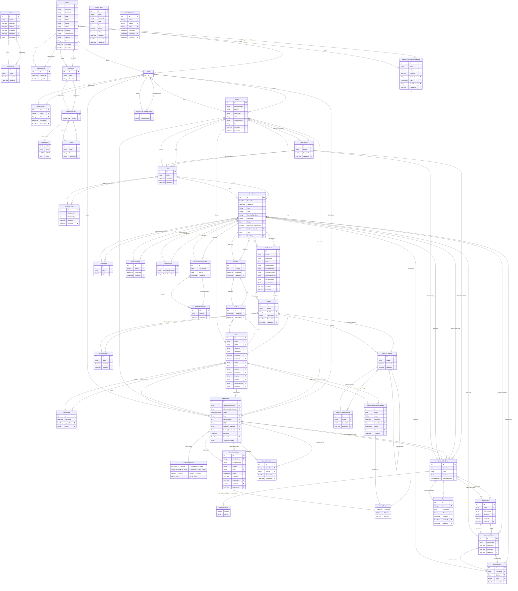

```mermaid
erDiagram

        AccessLevel {
            NONE NONE
READ READ
WRITE WRITE
FULL FULL
        }
    


        SalesOrderStatus {
            PENDING_APPROVAL PENDING_APPROVAL
APPROVED_EMAIL_SENT APPROVED_EMAIL_SENT
NEEDS_REVISION NEEDS_REVISION
REJECTED REJECTED
        }
    


        FulfillmentStatus {
            READY READY
IN_PO IN_PO
        }
    


        EmailStatus {
            PENDING PENDING
SENT SENT
FAILED FAILED
        }
    
  "Event" {
    Int id "🗝️"
    String name 
    DateTime dateStart 
    DateTime dateEnd "❓"
    DateTime createdAt 
    DateTime deletedAt "❓"
    String description "❓"
    }
  

  "EventImage" {
    Int id "🗝️"
    String image 
    DateTime createdAt 
    DateTime deletedAt "❓"
    }
  

  "Admin" {
    Int Id "🗝️"
    String Username 
    String Password 
    String Email 
    String Token "❓"
    String Image "❓"
    String Name "❓"
    DateTime Birthdate "❓"
    String PhoneNumber "❓"
    String Address "❓"
    String Gender "❓"
    DateTime CreatedAt 
    DateTime DeletedAt "❓"
    }
  

  "AdminSession" {
    Int Id "🗝️"
    DateTime LoginTime 
    DateTime LogoutTime "❓"
    }
  

  "AdminForgotPasswordRequest" {
    Int Id "🗝️"
    String Token 
    Boolean IsUsed 
    DateTime ExpiresAt 
    String SenderEmail "❓"
    EmailStatus Status 
    String ErrorMessage "❓"
    DateTime CreatedAt 
    }
  

  "Sales" {
    Int Id "🗝️"
    }
  

  "SalesCategory" {
    Int Id "🗝️"
    String Name "❓"
    String Region "❓"
    DateTime CreatedAt 
    DateTime DeletedAt "❓"
    }
  

  "Dealer" {
    Int Id "🗝️"
    String CompanyName 
    String Region "❓"
    String StoreCode 
    String Address "❓"
    String PhoneNumber "❓"
    String fax "❓"
    DateTime CreatedAt 
    DateTime DeletedAt "❓"
    }
  

  "User" {
    Int Id "🗝️"
    String Email 
    String Name "❓"
    String Password 
    String Username 
    DateTime CreatedAt 
    DateTime DeletedAt "❓"
    String Token "❓"
    String Image "❓"
    String Address "❓"
    DateTime Birthdate "❓"
    String Country "❓"
    String Gender "❓"
    String PhoneNumber "❓"
    String Province "❓"
    }
  

  "UserSession" {
    Int Id "🗝️"
    DateTime LoginTime 
    DateTime LogoutTime "❓"
    String Token "❓"
    }
  

  "UserForgotPasswordRequest" {
    Int Id "🗝️"
    String Token 
    Boolean IsUsed 
    DateTime ExpiresAt 
    String SenderEmail "❓"
    EmailStatus Status 
    String ErrorMessage "❓"
    DateTime CreatedAt 
    }
  

  "AdminRole" {
    Int Id "🗝️"
    String Name 
    String Description "❓"
    }
  

  "Menu" {
    Int Id "🗝️"
    String Name 
    String Path 
    String Description "❓"
    }
  

  "RoleMenuAccess" {
    Int Id "🗝️"
    AccessLevel Access 
    }
  

  "Cart" {
    Int Id "🗝️"
    DateTime CreatedAt 
    DateTime DeletedAt "❓"
    }
  

  "CartItem" {
    Int Id "🗝️"
    Int Quantity 
    DateTime CreatedAt 
    DateTime DeletedAt "❓"
    }
  

  "Price" {
    Int Id "🗝️"
    Float Price 
    DateTime CreatedAt 
    DateTime DeletedAt "❓"
    }
  

  "PriceCategory" {
    Int Id "🗝️"
    String Name 
    DateTime CreatedAt 
    DateTime DeletedAt "❓"
    }
  

  "WholesalePrice" {
    Int Id "🗝️"
    Int MinQuantity 
    Int MaxQuantity 
    DateTime CreatedAt 
    DateTime DeletedAt "❓"
    }
  

  "PriceHistory" {
    Int Id "🗝️"
    Float Price 
    DateTime UpdatedAt 
    }
  

  "Product" {
    Int Id "🗝️"
    String Name 
    String CodeName "❓"
    String Description "❓"
    DateTime CreatedAt 
    DateTime DeletedAt "❓"
    }
  

  "PartNumber" {
    Int Id "🗝️"
    String Name 
    String Description "❓"
    Int Dash "❓"
    Float InnerDiameter "❓"
    Float OuterDiameter "❓"
    Float WorkingPressure "❓"
    Float BurstingPressure "❓"
    Float BendingRadius "❓"
    Float HoseWeight "❓"
    DateTime CreatedAt 
    DateTime DeletedAt "❓"
    }
  

  "ItemCode" {
    Int Id "🗝️"
    DateTime CreatedAt 
    DateTime DeletedAt "❓"
    String Name 
    String OEM "❓"
    String StockingTypeCode 
    String SalesCode "❓"
    Float Weight "❓"
    Boolean AllowItemCodeSelection 
    Int MinOrderQuantity "❓"
    Float QtyPO "❓"
    Int OrderStep "❓"
    }
  

  "ItemCodeImage" {
    Int Id "🗝️"
    String Image "❓"
    DateTime CreatedAt 
    DateTime DeletedAt "❓"
    }
  

  "Warehouse" {
    Int Id "🗝️"
    String Name "❓"
    String BusinessUnit 
    String Location "❓"
    DateTime CreatedAt 
    DateTime DeletedAt "❓"
    }
  

  "WarehouseStock" {
    Int Id "🗝️"
    Float QtyOnHand 
    DateTime UpdatedAt 
    DateTime CreatedAt 
    DateTime DeletedAt "❓"
    }
  

  "ProductBrand" {
    Int Id "🗝️"
    String ProductBrandName "❓"
    String ProductBrandCode "❓"
    }
  

  "ProductImage" {
    Int Id "🗝️"
    String Image "❓"
    DateTime CreatedAt 
    DateTime DeletedAt "❓"
    }
  

  "ProductCategory" {
    Int Id "🗝️"
    String Name 
    DateTime CreatedAt 
    DateTime DeletedAt "❓"
    }
  

  "ProductCategoryImage" {
    Int Id "🗝️"
    String Image "❓"
    DateTime CreatedAt 
    DateTime DeletedAt "❓"
    }
  

  "StockHistory" {
    Int Id "🗝️"
    Float QtyBefore "❓"
    Float QtyAfter "❓"
    String Note "❓"
    DateTime UpdatedAt 
    }
  

  "ExcelStockHistory" {
    Int Id "🗝️"
    String FilePath 
    DateTime CreatedAt 
    }
  

  "ExcelStockHistoryDetail" {
    Int Id "🗝️"
    Float QtyOnHand 
    Float QtyPO 
    DateTime CreatedAt 
    }
  

  "SalesOrder" {
    Int Id "🗝️"
    String SalesOrderNumber "❓"
    String JdeSalesOrderNumber "❓"
    SalesOrderStatus Status 
    String Note "❓"
    Int PaymentTerm "❓"
    String FOB "❓"
    String CustomerPoNumber "❓"
    String DeliveryOrderNumber "❓"
    DateTime CreatedAt 
    DateTime DeletedAt "❓"
    String TransactionToken 
    }
  

  "SalesOrderDetail" {
    Int Id "🗝️"
    Int Quantity 
    Float Price 
    Float FinalPrice 
    FulfillmentStatus FulfillmentStatus 
    }
  

  "Tax" {
    Int Id "🗝️"
    String Name "❓"
    Float Percentage 
    Boolean IsActive 
    DateTime CreatedAt 
    DateTime UpdatedAt "❓"
    DateTime DeletedAt "❓"
    }
  

  "SalesOrderFile" {
    Int Id "🗝️"
    String ExcelFile "❓"
    String PdfFile "❓"
    DateTime CreatedAt 
    DateTime UpdatedAt "❓"
    }
  

  "EmailSalesOrder" {
    Int Id "🗝️"
    String SenderEmail "❓"
    String RecipientEmail 
    String Subject 
    String Body "❓"
    EmailStatus Status 
    DateTime CreatedAt 
    DateTime UpdatedAt "❓"
    DateTime DeletedAt "❓"
    DateTime ApprovedAt "❓"
    }
  

  "EmailSalesOrderRecipient" {
    Int Id "🗝️"
    String RecipientEmail 
    }
  

  "EmailConfig" {
    Int Id "🗝️"
    String Email 
    String Password 
    String Host 
    Int Port 
    Boolean Secure 
    Boolean IsActive 
    DateTime CreatedAt 
    DateTime UpdatedAt "❓"
    DateTime DeletedAt "❓"
    }
  

  "EmailTemplate" {
    Int Id "🗝️"
    String Name 
    String Subject "❓"
    String Body "❓"
    DateTime CreatedAt 
    DateTime UpdatedAt "❓"
    DateTime DeletedAt "❓"
    }
  
    "Event" o{--}o "EventImage" : "EventImage"
    "EventImage" o|--|| "Event" : "Event"
    "Admin" o|--|| "AdminRole" : "AdminRole"
    "Admin" o{--}o "AdminSession" : "AdminSession"
    "Admin" o{--}o "Sales" : "Sales"
    "Admin" o{--}o "AdminForgotPasswordRequest" : "ForgotPasswordRequests"
    "AdminSession" o|--|| "Admin" : "Admin"
    "AdminForgotPasswordRequest" o|--|| "EmailStatus" : "enum:Status"
    "AdminForgotPasswordRequest" o|--|| "Admin" : "Admin"
    "Sales" o|--|o "SalesCategory" : "SalesCategory"
    "Sales" o|--|| "Admin" : "Admin"
    "Sales" o{--}o "Dealer" : "Dealers"
    "Sales" o{--}o "SalesOrder" : "SalesOrders"
    "Sales" o{--}o "EmailSalesOrderRecipient" : "EmailRecipients"
    "SalesCategory" o{--}o "Sales" : "Sales"
    "Dealer" o|--|o "PriceCategory" : "PriceCategory"
    "Dealer" o{--}o "User" : "User"
    "Dealer" o{--}o "Price" : "Price"
    "Dealer" o{--}o "Sales" : "Sales"
    "Dealer" o{--}o "SalesOrder" : "SalesOrders"
    "User" o{--}o "UserSession" : "UserSession"
    "User" o{--}o "Cart" : "Cart"
    "User" o|--|o "Dealer" : "Dealer"
    "User" o{--}o "SalesOrder" : "SalesOrders"
    "User" o{--}o "UserForgotPasswordRequest" : "ForgotPasswordRequests"
    "UserSession" o|--|| "User" : "User"
    "UserForgotPasswordRequest" o|--|| "EmailStatus" : "enum:Status"
    "UserForgotPasswordRequest" o|--|| "User" : "User"
    "AdminRole" o{--}o "Admin" : "Admin"
    "AdminRole" o{--}o "RoleMenuAccess" : "RoleAccess"
    "Menu" o{--}o "RoleMenuAccess" : "RoleAccess"
    "RoleMenuAccess" o|--|| "AccessLevel" : "enum:Access"
    "RoleMenuAccess" o|--|| "AdminRole" : "AdminRole"
    "RoleMenuAccess" o|--|| "Menu" : "Menu"
    "Cart" o|--|| "User" : "User"
    "Cart" o{--}o "CartItem" : "CartItems"
    "CartItem" o|--|| "Cart" : "Cart"
    "CartItem" o|--|| "ItemCode" : "ItemCode"
    "Price" o|--|| "ItemCode" : "ItemCode"
    "Price" o|--|o "PriceCategory" : "PriceCategory"
    "Price" o|--|o "Dealer" : "Dealer"
    "Price" o{--}o "WholesalePrice" : "WholesalePrices"
    "PriceCategory" o{--}o "Price" : "Price"
    "PriceCategory" o{--}o "Dealer" : "Dealer"
    "PriceCategory" o{--}o "SalesOrderDetail" : "SalesOrderDetail"
    "WholesalePrice" o|--|| "Price" : "Price"
    "PriceHistory" o|--|| "ItemCode" : "ItemCode"
    "Product" o{--}o "ProductImage" : "ProductImage"
    "Product" o{--}o "PartNumber" : "PartNumber"
    "Product" o{--}o "ProductCategory" : "ProductCategory"
    "PartNumber" o|--|o "Product" : "Product"
    "PartNumber" o{--}o "ItemCode" : "ItemCode"
    "ItemCode" o{--}o "Price" : "Price"
    "ItemCode" o{--}o "PriceHistory" : "PriceHistory"
    "ItemCode" o|--|o "ProductBrand" : "ProductBrand"
    "ItemCode" o|--|o "PartNumber" : "PartNumber"
    "ItemCode" o{--}o "CartItem" : "CartItem"
    "ItemCode" o{--}o "SalesOrderDetail" : "SalesOrderDetail"
    "ItemCode" o{--}o "ItemCodeImage" : "ItemCodeImage"
    "ItemCode" o{--}o "ExcelStockHistoryDetail" : "Histories"
    "ItemCode" o{--}o "WarehouseStock" : "WarehouseStocks"
    "ItemCode" o{--}o "StockHistory" : "StockHistories"
    "ItemCodeImage" o|--|| "ItemCode" : "ItemCode"
    "Warehouse" o{--}o "WarehouseStock" : "Stocks"
    "Warehouse" o{--}o "SalesOrderDetail" : "SalesOrderDetails"
    "WarehouseStock" o|--|| "Warehouse" : "Warehouse"
    "WarehouseStock" o|--|| "ItemCode" : "ItemCode"
    "WarehouseStock" o{--}o "StockHistory" : "StockHistories"
    "ProductBrand" o{--}o "ItemCode" : "ItemCode"
    "ProductImage" o|--|| "Product" : "Product"
    "ProductCategory" o{--}o "ProductCategoryImage" : "ProductCategoryImage"
    "ProductCategory" o|--|o "ProductCategory" : "ParentCategory"
    "ProductCategory" o{--}o "ProductCategory" : "SubCategories"
    "ProductCategory" o{--}o "Product" : "Products"
    "ProductCategoryImage" o|--|| "ProductCategory" : "ProductCategory"
    "StockHistory" o|--|o "WarehouseStock" : "WarehouseStock"
    "StockHistory" o|--|| "ItemCode" : "ItemCode"
    "ExcelStockHistory" o{--}o "ExcelStockHistoryDetail" : "Details"
    "ExcelStockHistoryDetail" o|--|| "ExcelStockHistory" : "ExcelStockHistory"
    "ExcelStockHistoryDetail" o|--|| "ItemCode" : "ItemCode"
    "SalesOrder" o|--|| "SalesOrderStatus" : "enum:Status"
    "SalesOrder" o{--}o "SalesOrderDetail" : "SalesOrderDetails"
    "SalesOrder" o|--|| "Dealer" : "Dealer"
    "SalesOrder" o|--|| "User" : "User"
    "SalesOrder" o|--|| "Sales" : "Sales"
    "SalesOrder" o{--}o "EmailSalesOrder" : "EmailSalesOrders"
    "SalesOrder" o{--}o "SalesOrderFile" : "SalesOrderFile"
    "SalesOrderDetail" o|--|| "FulfillmentStatus" : "enum:FulfillmentStatus"
    "SalesOrderDetail" o|--|| "SalesOrder" : "SalesOrder"
    "SalesOrderDetail" o|--|o "Warehouse" : "Warehouse"
    "SalesOrderDetail" o|--|| "ItemCode" : "ItemCode"
    "SalesOrderDetail" o|--|o "PriceCategory" : "PriceCategory"
    "SalesOrderDetail" o|--|o "Tax" : "Tax"
    "Tax" o{--}o "SalesOrderDetail" : "SalesOrderDetails"
    "SalesOrderFile" o|--|| "SalesOrder" : "SalesOrder"
    "EmailSalesOrder" o|--|| "EmailStatus" : "enum:Status"
    "EmailSalesOrder" o|--|| "SalesOrder" : "SalesOrder"
    "EmailSalesOrderRecipient" o|--|| "Sales" : "Sales"
```
